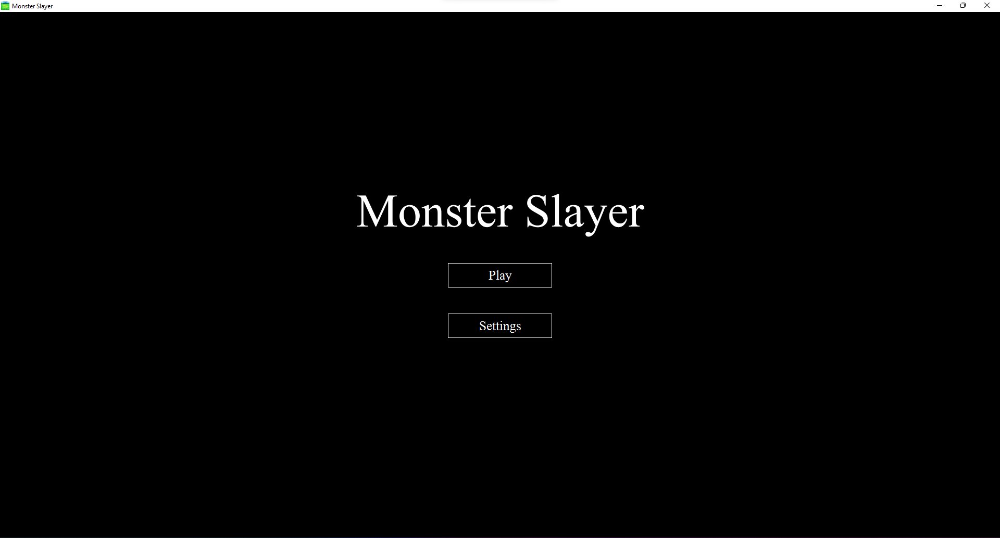
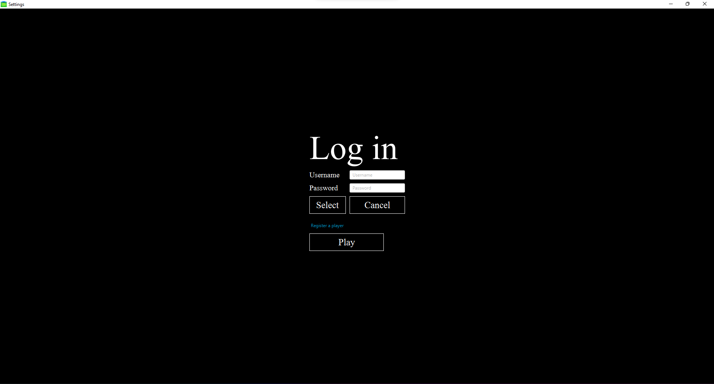
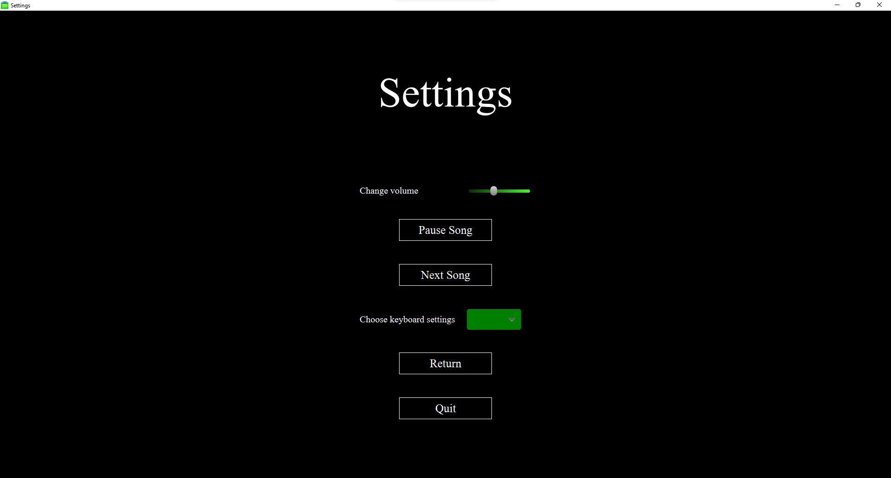
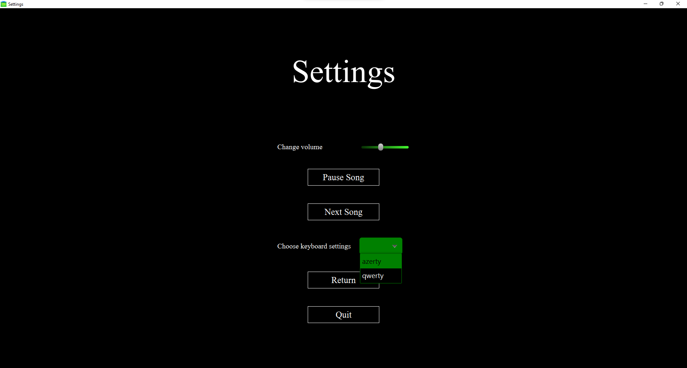
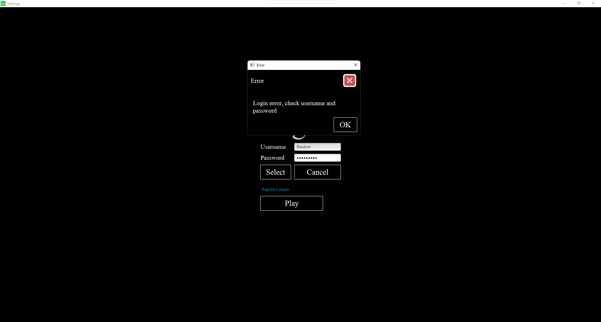
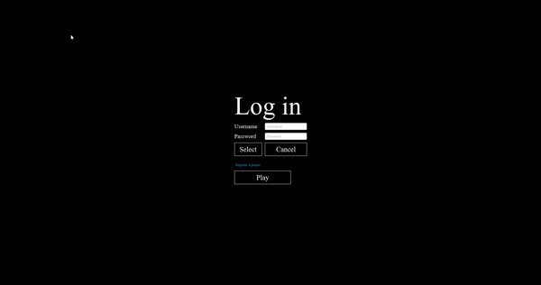
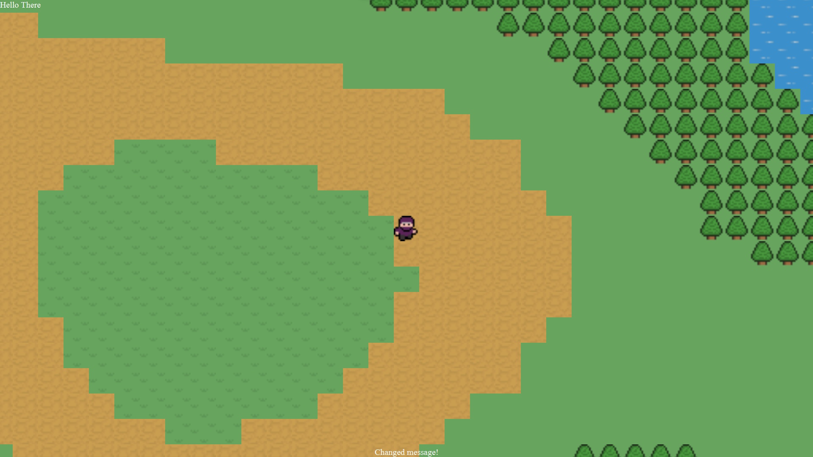
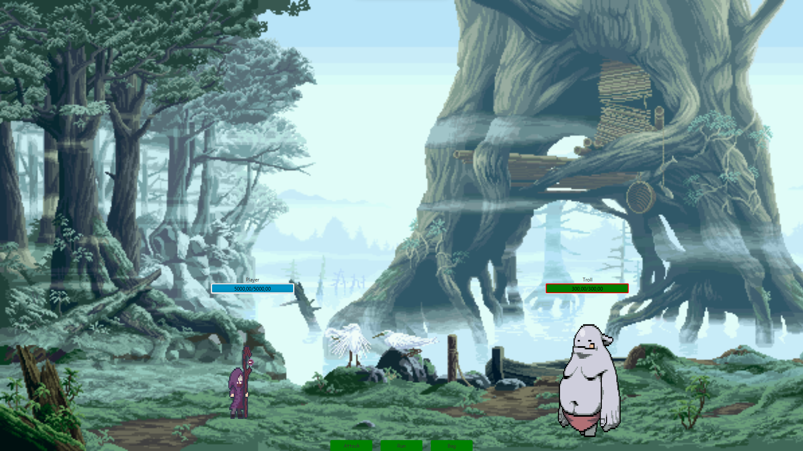
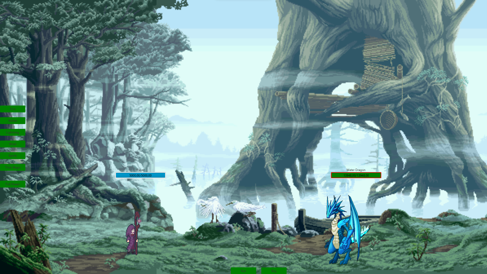

# ProjectMonsterSlayer

- [The Concept](#the-concept)
- [A look through the application](#a-look-through-the-application)
- [The Game](#the-game)
    - [The Player](#the-player)
    - [The Enemies](#the-enemies)
    - [The Battle](#the-battle)
    - [NPC's](#npc's)
    - [Quests](#quests)
    - [Items](#items)
    - [The Map](#the-map)

## The Concept  

This is a project I came up with for fun. A player roams around a world and kills monsters. That prety much sums up the game.  
This project is made entirely in java using the javafx library, and a little bit of css.

## A look through the application  

The game starts up and this will be the first screen you see:   
Starting from this screen the user has 3 options:
- Switch to the select screen to select a player and start playing the game 
- Switch to the setting screen to change some of the settings 
- Close the game

The setting screen has a couple of settings.  
The user can change the volume of the music and can change and pause the song.  
It is possible to change keyboard settings of the game to match qwerty or azerty keyboards .  

The select screen is the gateway to playing the game. An existing user must be chosen from the database (not yet implemented), otherwise an error message will pop up.   
Navigation is possible between textfields by pressing up and down arrow keys. Furthermore, when the arrow down key is pressed while in the password field, the select button wil be activated. Pressing enter at any given time should activate the play button and start the game.  
  
Passwords are stored in the database as a salted hash.

Users can create a new player by clicking the hyperlink (not yet implemented).

## The Game  

After selecting an existing player, the game can be started.   
The goal of the game is just to kill monsters, gain loot and reach the max level.
The map exists out of tiles, certain tiles will trigger a monster encounter and a battle will ensue.
Monsters drop loot and exp, the more monsters a player kills, the more exp and thus the higher your level and power will be.
Throughout the map different NPC's can spawn with different interaction events.  

### The Player  

The player will always be the same. A mage with a purple robe. However players can choose a specific affinity.
There are 5 elements in the game.  
- Fire
- Water
- Wind
- Earth
- Lightning  

When creating a player, the user can choose which of these 5 elements will be their affinity.  
More about affinities and elements in the battle section.

A new player will start out as level 1 and with 100 gold.  
The maximum level a player can reach is level 50.  

Each player has an inventory. As a new player, this will be empty.  
Different items can be stored in an inventory.  

Each player also has a set of skills like higher mana efficiency, higher power and new attacks. A new player does not have any skills.  
Skills can be learned from a certain NPC.

As a member of the adventurer guild, a player will have a rank from F to S+ based on their contributions.  
New players need to register at an adventure guild before receiving a rank.  
Higher ranks means better perks (not fully implemented).  

### The Enemies  

Currently there are 5 monsters in the game, ranked by strength they are:  

1. **The dragons**
2. **The golems**
3. **The troll**
4. **The goblin**
5. **The slime**

Only dragons and golems have elemental varients, this means there are 5 different types, for example: Fire Dragon, Wind Golem, Water Golem, Earth Golem, Lightning Dragon.  
Each monster has a certain chance of ***evolving***. Going through evolution will make a monster more powerfull.  
Depending on the level of the player, different monsters will be encountered.  
A level 1 player, for example, will only encounter slimes, while a level 50 player will only encounter dragons and golems.  

Aside from health and attack power, trolls, golems and dragons also have damage reduction.  

### The Battle  

Triggering an encounter will change the screen to a *battle screen*. 
Each player has a manapool. At level 1 this will be 100. At level 50 this will be 5000.  

The battle is turn based, the player will always go first, then the enemy.  
The player has 3 choices, attack, run or use an item from the bag.  

A player can attack with any of the 5 elements, each attack will cost a certain amount of mana. Each element has different effects.  
When attacking with the same element as a players affinity, damage will be increased. 

Every attack has a chance to be a critical hit, which will increase damage. However, although small, every attack also has a chance of failure.  

If the enemy has elemental varients, attacking with the same element as the enemies elemental type will greatly reduce damage. Attacking with the opposite element will greatly increase damage.  
For example: attacking a Water golem with the Water element will reduce damage, attacking a Fire dragon with the Water element will greatly increase damage. Attacking a Water golem with the Fire element will greatly decrease damage.  

After taking an attack the enemy will counter-attack. To avoid death, the player character will automatically deploy a mana shield that withstands damage.  
Damage taken by the mana shield will reduce your manapool. When your manapool reaches 0, a mana shield can no longer be deployed and the enemy's next attack will kill, triggering a game over.  

The player can try to run at any time. Though there's a chance the run will fail, in this case running will be disabled for the rest of the encounter. The more attacks are launched, the lower the chance of succesfully escaping the encounter.  

### NPC's  

There's 3 different types of NPC's: the merchant, the sage and the adventurers (only sage is currently implemented).  

There will be multiple merchants throughout the map, each merchant will sell items based on the players level. The lower a players level, the lower the quality of the items.  
Merchants will buy magic stones that you collect by slaying monsters.  
Depending on the adventurers rank, the price of the items will change.  

Across the map, there will be only 1 sage. The sage is the only NPC that can teach the player skills.  

Adventurers will mostly have no interactions, but a select few might trigger some interesting events.  

 
### Quests  

(Not fully implemented) At the adventurers guild, quests can be accepted. Completing a quest will give gold and exp and in rare cases special items.  
Given quests are based on adventurers rank and not level.  

### Items  

There are 6 different item grades:

0. **damaged**
1. **Uncommon**
2. **Rare**
3. **Epic**
4. **Legendary**
5. **Mythical**

The higher an items grade, the higher it's effect.
4 different item types currently exist.

- **Mana potions**
- **Power potions**
- **Weapons**
- **Armor** 

Only potions can be used during battle from the inventory.
Weapons and Armor need to be equipped before battle in order to gain their effect.  

### The Map  

There are 3 different ways to load in the map that are currently implemented: 

- Map generation from a text file (50 by 50 tiles wide (can be expanded but takes too much effort))
- Random map generation using OpenSimplexNoise (2048 by 2048 wide (can be expanded, takes no effort))
- map generation from an image (512 by 512 wide (can be expanded, takes moderate effort))

Since random map generation currently only generates terrain and not NPC's and buildings, map generation from an image is the best way of building the map.  
The random map generation can be converted to an image and used as the base for the image->map generation.
